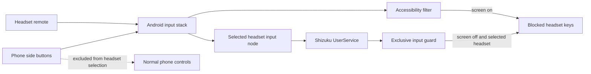

# Architecture

Button Silencer uses two independent Android paths because screen-on and screen-off input handling have different constraints.

## Screen-on path

`ButtonBlockerService` is an Accessibility service that filters supported key events before applications receive them. Call-capable headset keys remain blocked whenever protection is enabled; optional rules control the less safety-critical media, volume, and assistant keys.

## Screen-off path

`ShizukuController` owns permission, UserService binding, and reconnect behavior. `PrivilegedMediaKeyService` runs through Shizuku and maintains the privileged screen-off routes.

For a selected headset, `EvdevExclusiveGuard` uses Linux `EVIOCGRAB` through a small JNI bridge. Grabbing is limited to external nodes classified as safe remote-control devices. Internal phone-button nodes, keyboard-like nodes, and audio-routing switch nodes are rejected.

## Recovery

Recovery is event-driven. Binder death triggers bounded reconnect attempts, and `/dev/input` topology changes trigger headset-node reacquisition. The guard reader blocks in the kernel while idle and is woken through a cancellation pipe during shutdown.

## Safety invariants

- Phone side-button devices are not valid headset targets.
- Full protection is not reported unless the selected-headset exclusive guard is active.
- Call and end-call controls do not depend on optional media-filter settings.
- A partial or unavailable Shizuku path does not disable the independent screen-on Accessibility path.
